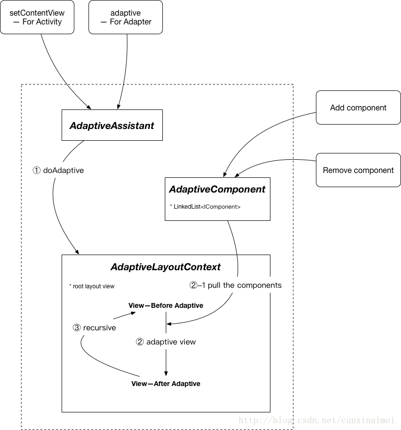

Android自适应布局解决方案

[](https://jitpack.io/#cunxinaimei/AdaptiveAnkoComponent)

# Android UI自适应解决方案

## 前言

项目地址：[AdaptiveAnkoComponent](https://github.com/nobeginning/AdaptiveAnkoComponent)

因为之前一直使用的鸿洋的[AndroidAutoLayout](https://github.com/hongyangAndroid/AndroidAutoLayout)（貌似目前停止维护了），所以对这种模式的自适应方案比较认同。但是我是一个JetBrains的粉丝，在学习[Anko](https://github.com/Kotlin/anko)的时候发现这套方案不适用了，于是打算自己来实现一套。

最终形成的这套方案特点如下：

* 使用Kotlin开发（顺便推广一下，用了Kotlin之后，基本上不会再喜欢写java的代码了）
* 超低侵入性（不需要继承Activity，不需要改变之前的layout文件，只需要依赖+配置meta）
* 拔插式组件（哪里不爽拔哪里，哪里不爽插哪里）
* 并同时支持普通的layout模式和Anko模式

欢迎各种送花和拍砖，砖头越多越好，想盖房子，就差板砖了~~

另外，如果本文读起来有任何不顺畅或者不合理的地方，也请帮忙提出来，感谢！

## 如何使用

### Step1

```groovy
repositories {
        ...
        maven { url 'https://jitpack.io' }
    }
```


### Step2

```
dependencies {
    ...
    compile 'com.github.nobeginning.AdaptiveAnkoComponent:adaptive-anko:0.2.3'
    compile 'com.github.nobeginning.AdaptiveAnkoComponent:adaptive:0.2.3'
}
```


### Step3

In AndroidManifest.xml

```xml
<application
        android:allowBackup="true"
        android:icon="@mipmap/ic_launcher"
        android:label="@string/app_name"
        android:roundIcon="@mipmap/ic_launcher_round"
        android:supportsRtl="true"
        android:theme="@style/AppTheme.NoActionBar">
        <meta-data
            android:name="com.young.adaptive.designWidth"
            android:value="720" />
        <meta-data
            android:name="com.young.adaptive.designHeight"
            android:value="1280" />
		<activity ... ></activity>
</application>
```

In layout xml:
> 直接以px为单位按照设计稿即可

```
<TextView
        android:layout_width="wrap_content"
        android:layout_height="wrap_content"
        android:text="AutoSized List Title"
        android:textSize="30px"/>
```


### Step4

In Activity:

```kotlin
AdaptiveAssistant().setContentView(this, R.layout.activity_xxx)
```


In Adapter:

```kotlin
......

val layoutAssistant = LayoutAssistant()

......

override fun getView(position: Int, convertView: View?, parent: ViewGroup?): View {
            val view = convertView ?: layoutAssistant.adaptive(this@NormalActivity, parent ,R.layout.cell_for_list)
            view.tvTitle.text = "Title -> ${getItemId(position)}"
            view.tvDesc.text = "Description -> ${getItemId(position)}"
            return view
        }
```


## 详解

### 图解



### 代码及思路介绍

#### 主要类的介绍

##### AdaptiveAssistant

> 自适应入口，提供了基于Activity和Adapter的自适应方法


##### AdaptiveComponent

> 内部维护了一个IComponent链表，用以管理自适应组件，同时对外暴露了管理组件的add及remove方法，便于使用者自己扩展


##### IComponent

> 抽象出的自适应组件接口


##### AdaptiveLayoutContext

> 核心类，用于处理自适应逻辑


##### AdaptiveViewManager

> 用于Anko的支持，待优化


#### 核心思路

先看一下Activity的setContentView最终实现：

```java
@Override
    public void setContentView(View v) {
        ensureSubDecor();
        ViewGroup contentParent = (ViewGroup) mSubDecor.findViewById(android.R.id.content);
        contentParent.removeAllViews();
        contentParent.addView(v);
        mOriginalWindowCallback.onContentChanged();
    }

    @Override
    public void setContentView(int resId) {
        ensureSubDecor();
        ViewGroup contentParent = (ViewGroup) mSubDecor.findViewById(android.R.id.content);
        contentParent.removeAllViews();
        LayoutInflater.from(mContext).inflate(resId, contentParent);
        mOriginalWindowCallback.onContentChanged();
    }
```

我们可以发现，以layoutId为参数的方法，其实现也是通过LayoutInflater做inflate。那么思路来了：我们可以仿写一个``setContentView(int resId)``方法，使用``LayoutInflater.inflate``方法拿到View对象，拿到View对象之后，对这个View对象做一些操作，之后使用``Activity.setContentView(View v)``方法，最终把view添加到Activity。梳理一下：

1. 定义``setContentView(int layoutId)``方法
2. 在方法中使用``LayoutInflater.inflate``方法，拿到View对象
3. ***基于View对象做自适应***
4. 调用``Activity.setContentView(View v)``方法，把自适应之后的View对象add到Activity

OK，那我们的重点就在第三步。接着往下梳理。

从**图解**中可以看到，有``AdaptiveComponent``类维护了一个``IComponent``的List。

那如果要对View做自适应，我的方案就是递归root view，拿到每一个子View，对这个View做自适应，具体代码如下：

```kotlin
private fun adaptiveView(context: Context, view: View): View {
        val screenWidth = AdaptiveComponent.getScreenWidth(context)
        val screenHeight = AdaptiveComponent.getScreenHeight(context)

        val components = AdaptiveComponent.getAllComponents()
  
  		//重点1--遍历组件list，并调用组件的自适应方法处理view
        components.forEach {
            it.adaptive(view, screenWidth, screenHeight, AdaptiveComponent.getDesignWidth(ctx), AdaptiveComponent.getDesignHeight(ctx))
        }

        if (view is ViewGroup) {
            val childCount = view.childCount
            (0 until childCount)
                    .map { view.getChildAt(it) }
                    .forEach { adaptiveView(context, it) }	//重点2--如果是ViewGroup，做递归调用
        }
        return view
    }
```

从代码中可以看到，具体的自适应操作是在``AdaptiveLayoutContext``这个类完成的，那如何自适应，哪些属性需要自适应，则是在``AdaptiveComponent``里边来管理的，具体的就是``IComponent``的List，这个list中的每个组件都会在处理每一个View的时候被执行一遍。

例如，我预置了3种：``PaddingComponent``（用于处理View的Padding属性）、``ParameterComponent``（用于处理View的layoutParameter，可能更多的是margin）、``TextSizeComponent``（用于处理TextView的textSize），使用者如果没有其他额外需求的话，使用预置的这几个就可以了，但是当预置的这几个无法满足使用者的需求时，使用者只需要自己实现``IComponent``针对自己需要的View属性进行自适应，然后调用``AdaptiveComponent.add(component: IComponent) ``方法把自己的组件进行插入即可。

``IComponent``抽象如下：

```kotlin
interface IComponent {
    /**
     * @param view  		正在进行自适应处理的View
     * @param screenWidth   屏幕宽度
     * @param screenHeight  屏幕高度
     * @param designWidth   设计稿宽度
     * @param designHeight  设计稿高度
     */
    fun adaptive(view: View, screenWidth: Int, screenHeight: Int, designWidth: Int, designHeight: Int)
}
```

``PaddingComponent``处理逻辑：

```kotlin
class PaddingComponent : IComponent {
    override fun adaptive(view: View, screenWidth: Int, screenHeight: Int, designWidth: Int, designHeight: Int) {
        var paddingLeft = 0
        if (view.paddingLeft > 0) {
            paddingLeft = AdaptiveComponent.calculate(designWidth, screenWidth, view.paddingLeft)
        } else if (view.paddingLeft == PX_1) {
            paddingLeft = PX_UNIT
        }

        var paddingTop = 0
        if (view.paddingTop > 0) {
            paddingTop = AdaptiveComponent.calculate(designHeight, screenHeight, view.paddingTop)
        } else if (view.paddingTop == PX_1) {
            paddingTop = PX_UNIT
        }

        var paddingRight = 0
        if (view.paddingRight > 0) {
            paddingRight = AdaptiveComponent.calculate(designWidth, screenWidth, view.paddingRight)
        } else if (view.paddingRight == PX_1) {
            paddingRight = PX_UNIT
        }

        var paddingBottom = 0
        if (view.paddingBottom > 0) {
            paddingBottom = AdaptiveComponent.calculate(designHeight, screenHeight, view.paddingBottom)
        } else if (view.paddingBottom == PX_1) {
            paddingBottom = PX_UNIT
        }

        view.setPadding(paddingLeft, paddingTop, paddingRight, paddingBottom)
    }
}
```

``ParameterComponent``处理逻辑：

```kotlin
open class ParameterComponent : IComponent {
    override fun adaptive(view: View, screenWidth: Int, screenHeight: Int, designWidth: Int, designHeight: Int) {
        val params: ViewGroup.LayoutParams? = view.layoutParams
        params?.apply {
            view.layoutParams = autoLayoutParameters(params, screenWidth, screenHeight, view, designWidth, designHeight)
        }
    }

    open fun autoLayoutParameters(params: ViewGroup.LayoutParams,
                                  screenWidth: Int, screenHeight: Int,
                                  view: View,
                                  designWidth: Int, designHeight: Int): ViewGroup.LayoutParams {
        if (params.width > 0) {
            params.width = AdaptiveComponent.calculate(designWidth, screenWidth, params.width)
        } else if (params.width == PX_1) {
            params.width = PX_UNIT
        }
        if (params.height > 0) {
            params.height = AdaptiveComponent.calculate(designHeight, screenHeight, params.height)
        } else if (params.height == PX_1) {
            params.height = PX_UNIT
        }

        if (params is ViewGroup.MarginLayoutParams) {
            if (params.leftMargin > 0) {
                params.leftMargin = AdaptiveComponent.calculate(designWidth, screenWidth, params.leftMargin)
            } else if (params.leftMargin == PX_1) {
                params.leftMargin = PX_UNIT
            }
            if (params.rightMargin > 0) {
                params.rightMargin = AdaptiveComponent.calculate(designWidth, screenWidth, params.rightMargin)
            } else if (params.rightMargin == PX_1) {
                params.rightMargin = PX_UNIT
            }
            if (params.topMargin > 0) {
                params.topMargin = AdaptiveComponent.calculate(designHeight, screenHeight, params.topMargin)
            } else if (params.topMargin == PX_1) {
                params.topMargin = PX_UNIT
            }
            if (params.bottomMargin > 0) {
                params.bottomMargin = AdaptiveComponent.calculate(designHeight, screenHeight, params.bottomMargin)
            } else if (params.bottomMargin == PX_1) {
                params.bottomMargin = PX_UNIT
            }
        }
        return params
    }
}
```


``TextSizeComponent``处理逻辑：

```kotlin
class TextSizeComponent : IComponent {
    override fun adaptive(view: View, screenWidth: Int, screenHeight: Int, designWidth: Int, designHeight: Int) {
        if (view is TextView) {
            val textSize = view.textSize
            view.setTextSize(TypedValue.COMPLEX_UNIT_PX, AdaptiveComponent.calculate(designHeight, screenHeight, textSize))
        }
    }
}
```

当然，如果使用者觉得，作者预置的这些组件完全不能满足我的要求，为此提供了预置组件删除功能

``AdaptiveComponent.initWithoutPreset()``或者参考如下代码进行个别预置组件的删除：

```kotlin
fun removePresetComponent(@PresetComponent component: String) {
        when (component) {
            COMPONENT_PRESET_PADDING -> remove(presetPaddingComponent)
            COMPONENT_PRESET_PARAMETER -> remove(presetParameterComponent)
            COMPONENT_PRESET_TEXT_SIZE -> remove(presetTextSizeComponent)
        }
    }
```


其实最上方的**图解**已经基本说明了工作原理，``AdaptiveComponent``类还有一些其他可以直接用的小功能，如：

***获取屏幕宽度***

```kotlin
fun getScreenWidth(context: Context):Int{
        if (displayMetrics==null){
            initDisplayMetrics(context)
        }
        return displayMetrics!!.widthPixels
    }
```

***获取屏幕高度***

```kotlin
fun getScreenHeight(context: Context):Int{
        if (displayMetrics==null){
            initDisplayMetrics(context)
        }
        return displayMetrics!!.heightPixels
    }
```

***计算自适应值***

```kotlin
fun calculate(designValue: Int, screeValue: Int, originValue: Int): Int {
        if (designValue <= 0) {
            Log.w(LOG_TAG, "Found design value **$designValue** is invalid. Have u forgot it?")
            return originValue
        }
        var result = (originValue.toDouble() * screeValue.toDouble() / designValue.toDouble()).toInt()
        if (result <= 0) {
            result = 1
        }
        return result
    }

    fun calculate(designValue: Int, screeValue: Int, originValue: Float): Float {
        if (designValue <= 0) {
            Log.w(LOG_TAG, "Found design value **$designValue** is invalid. Have u forgot it?")
            return originValue
        }
        var result = (originValue.toDouble() * screeValue.toDouble() / designValue.toDouble()).toFloat()
        if (result < 1f) {
            result = 1f
        }
        return result
    }

```


大致先介绍这么些吧。目前这套方案在公司项目的一些简单页面中实验。

Anko部分的支持还在优化，后续放出吧。基本原理都是一样的。

对于新出的View，理论上这套方案是默认支持的，但是如果有新的属性，那就需要扩展组件去对这些新属性进行自适应处理了。

当然有问题也是避免不了的，目前已知的问题如下：

* 在layout中使用任何单位px/dp/sp，都会执行自适应。
* 因为是插拔式组件，而且``IComponent``接口又非常的开放，权限放的很开，所以在这个接口的实现里可以对View做任何事。
* 这一点原因同上，如果存在多个组件对View的同一个属性都做了自适应，那会导致这多个组件都生效，从而结果超出预期。比如：View1的padding为10，组件A对View1的padding做了自适应，结果变成了20，之后组件B也对View1的padding进行了自适应处理，结果从20变成了40。所以在使用过程中还需要注意。
* 对于Anko的支持问题，因为定义了Anko上下文，所以用了这套方案之后，IDEA的Anko预览插件就会失效

The End.

## 感谢

鸿洋

JetBrains

Anko项目组
